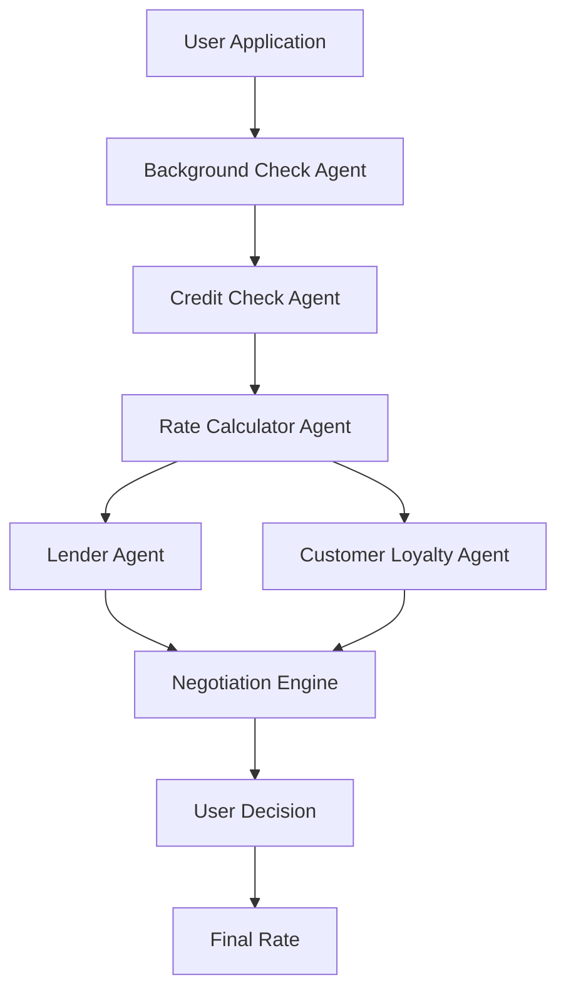

# 🏦⚔️ GAME OF LOANS

> **"Winter is coming… for unfair mortgage rates."**

An AI-powered **Mortgage Rate Negotiator** that pits intelligent agents against each other to secure the best possible mortgage rates for consumers.

  

---

## 🎯 The Problem

Mortgage rates are often non-negotiable, leaving consumers powerless against lenders. Traditional mortgage shopping involves:
- ❌ Limited transparency in rate determination
- ❌ No negotiation leverage for consumers  
- ❌ Complex processes with hidden fees
- ❌ One-sided power dynamic favoring lenders

## 🚀 Our Solution

**Game of Loans** simulates a mortgage application process where AI agents negotiate on behalf of both parties:

1. **📋 Application Processing** - Automated mortgage application with background & credit checks
2. **📊 Real Data Integration** - Baseline APR computed from FRED, Freddie Mac PMMS, and Zillow APIs
3. **🤖 AI Agent Negotiation** - Lender Agent vs Customer Loyalty Agent battle
4. **⚖️ Fair Play Rules** - 5% floor below baseline rate enforced
5. **🎮 Interactive Experience** - Users can accept, counter, or reject offers

---

## 🏗️ Architecture



### 🤖 Agent Ecosystem

| Agent | Role | Capabilities |
|-------|------|-------------|
| **Lender Agent** | Maximize profit while staying competitive | Rate optimization, risk assessment |
| **Customer Loyalty Agent** | Secure best rates for consumer | Negotiation tactics, market analysis |
| **Background Check Agent** | Verify applicant information | Identity verification, employment check |
| **Credit Check Agent** | Assess creditworthiness | Credit score analysis, debt-to-income |
| **Rate Calculator Agent** | Compute baseline rates | Real-time market data integration |

---

## 🛠️ Tech Stack

### Core Technologies
- **🤖 AI Framework**: [Inkeep](https://docs.inkeep.com/) - Multi-agent orchestration
- **☁️ Cloud Environment**: [Daytona](https://daytona.io/) - Development sandbox
- **🌐 APIs**: FRED, Freddie Mac PMMS, Zillow
- **💾 Database**: SQLite with Drizzle ORM
- **🎨 Frontend**: HTML5 + JavaScript + CSS3

### Development Tools
- **📦 Package Manager**: pnpm
- **🔧 Build System**: Turbo
- **📝 Language**: TypeScript + JavaScript
- **🐍 Python**: Agent testing and simulation

---

## 🚀 Quick Start

### Prerequisites
- Node.js 18+ 
- pnpm
- Python 3.8+
- Daytona account (for cloud deployment)

### Installation

```bash
# Clone the repository
git clone https://github.com/jlaplante333/Game-Of-Loans.git
cd Game-Of-Loans/my-agent-directory

# Install dependencies
pnpm install

# Set up environment
cp .env.example .env
# Add your API keys to .env

# Start development servers
pnpm dev
```

### 🌐 Access Points

- **Dashboard**: http://localhost:3000
- **Manage API**: http://localhost:3002
- **Run API**: http://localhost:3003
- **Mortgage UI**: Open `mortgage-ui.html` in browser

---

## 🎮 How to Play

### 1. **Start Your Application**
- Fill out the mortgage application form
- Provide personal and financial information
- Submit for processing

### 2. **Watch the Agents Work**
- Background check agent verifies your information
- Credit check agent analyzes your creditworthiness
- Rate calculator computes baseline APR from real market data

### 3. **Enter the Negotiation Arena**
- Lender Agent proposes initial rate
- Customer Loyalty Agent counters with better terms
- Watch the AI agents battle for the best deal

### 4. **Make Your Move**
- **Accept** - Take the current offer
- **Counter** - Propose your own terms
- **Reject** - Walk away from the deal

### 5. **Secure Your Rate**
- Final rate is guaranteed to be at least 5% below baseline
- Complete your mortgage application
- Celebrate your victory! 🎉

---

## 📊 Real Data Integration

Our system pulls live data from:

- **📈 FRED API** - Federal Reserve Economic Data
- **🏠 Freddie Mac PMMS** - Primary Mortgage Market Survey
- **🏘️ Zillow API** - Real estate market trends
- **💳 Credit Bureaus** - Credit score and history data

---

## 🧪 Testing & Simulation

```bash
# Run agent tests
python src/game-of-loans/test-agents.js

# Start realistic simulation
python realistic-agent-simulation.js

# Test in Daytona sandbox
python daytona_agent_test.py
```

---

## 🏆 Hackathon Features

### ✅ **MVP Complete**
- [x] Multi-agent mortgage negotiation system
- [x] Real-time rate calculation from market data
- [x] Interactive web interface
- [x] Background and credit check simulation
- [x] 5% rate floor enforcement

### 🚀 **Advanced Features**
- [x] Daytona cloud deployment
- [x] Persistent dashboard
- [x] Email webhook integration
- [x] Comprehensive testing suite
- [x] Realistic agent simulation

### 🎯 **Demo Ready**
- [x] Live mortgage application form
- [x] Real-time agent negotiation display
- [x] Market data visualization
- [x] Mobile-responsive design

---

## 📁 Project Structure

```
Game-Of-Loans/
├── my-agent-directory/
│   ├── src/game-of-loans/
│   │   ├── agents.ts              # Core agent definitions
│   │   ├── weather.graph.ts       # Agent orchestration
│   │   ├── email-webhook.js       # Email integration
│   │   └── test-agents.js         # Testing suite
│   ├── apps/
│   │   ├── manage-api/            # Management API
│   │   └── run-api/               # Runtime API
│   ├── mortgage-ui.html          # Main application UI
│   ├── requirements.txt          # Python dependencies
│   └── package.json              # Node.js dependencies
```

---

## 🤝 Contributing

This is a hackathon project! Feel free to:
- 🐛 Report bugs
- 💡 Suggest features  
- 🔧 Submit pull requests
- 📖 Improve documentation

---

## 📄 License

MIT License - Feel free to use this project for your own hackathons!

---

## 🏆 Team

Built with ❤️ for the hackathon by:
- **AI Agent Architecture**: Multi-agent negotiation system
- **Real Data Integration**: Live market rate calculations
- **Cloud Deployment**: Daytona sandbox integration
- **User Experience**: Interactive mortgage negotiation

---

## 🎯 Future Enhancements

- [ ] **Machine Learning** - Predictive rate modeling
- [ ] **Blockchain Integration** - Smart contract negotiations
- [ ] **Mobile App** - Native iOS/Android experience
- [ ] **Advanced Analytics** - Market trend predictions
- [ ] **Multi-Language Support** - International markets

---

## 📞 Contact

**Project Repository**: https://github.com/jlaplante333/Game-Of-Loans

**Live Demo**: Available in Daytona sandbox environment

---

*"In the Game of Loans, you either win or you pay too much."* 🏦⚔️

